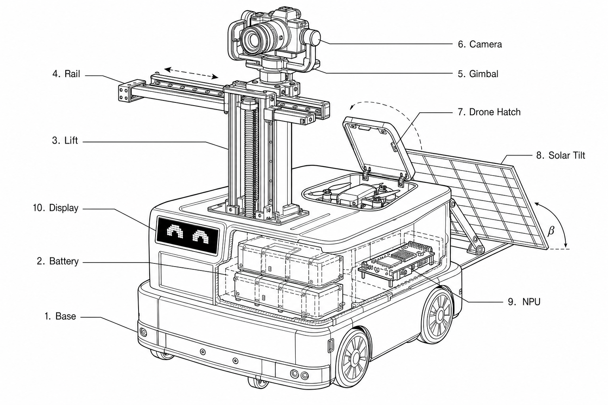
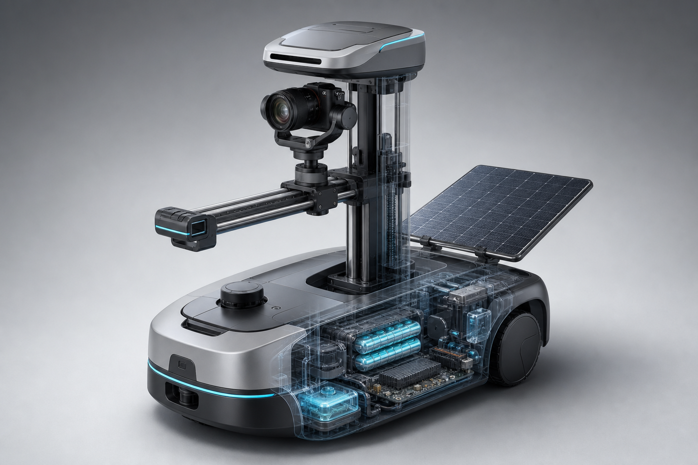

# 视觉识别模块：现状 vs 真 YOLO，以及怎么换

## 1. 现在怎么做的

```text
图片/帧
  → VisionBackend.detect_primary_subject()   # 可插拔
  → ReferenceAnalysis.subject (bbox/center)
  → photo_mode: viewpoint / lighting / color.wheel / camera_parameters
  → planner / video_mode
```

| 模块 | 路径 | 作用 |
|------|------|------|
| 后端接口 | [`camerobot/vision/backend.py`](../camerobot/vision/backend.py) | `VisionBackend` 协议 + `get_vision_backend()` |
| 启发式（默认） | [`camerobot/vision/heuristic_backend.py`](../camerobot/vision/heuristic_backend.py) | 按画幅/意图给固定框，无神经网络 |
| YOLO 插槽 | [`camerobot/vision/yolo_backend.py`](../camerobot/vision/yolo_backend.py) | 设模型路径后走 ONNX；无权重则安全回落启发式 |
| 色彩 | [`camerobot/color_wheel.py`](../camerobot/color_wheel.py) | HSV **12 扇区色轮** + 互补/类似色 |
| 相机参数 | [`camerobot/camera_params.py`](../camerobot/camera_params.py) | ISO/快门/光圈/焦距/WB…（JPEG EXIF 优先，否则估计） |

环境变量：

```bash
export CAMEROBOT_VISION_BACKEND=heuristic   # 默认
# 或
export CAMEROBOT_VISION_BACKEND=yolo
export CAMEROBOT_YOLO_MODEL=/path/to/yolo11n.onnx
```

代码注入（测试）：

```python
from camerobot.vision import set_vision_backend
from camerobot.vision.yolo_backend import YoloVisionBackend
set_vision_backend(YoloVisionBackend())
```

## 2. 真 YOLO 和现在的区别

| | 现在 heuristic | 真 YOLO（目标） |
|--|----------------|-----------------|
| 主体框 | 按竖/横构图猜一个框 | 网络在像素里检出人/脸/物 |
| 置信度 | 固定偏低 | 随检出质量变化 |
| 多人/走动 | 基本不会对 | 可跟最高分轨 / ByteTrack |
| 依赖 | 零模型文件 | ONNX/RKNN + NPU/CPU |
| `subject.vision_backend` | `"heuristic"` | `"yolo:yolo11n.onnx"` 等 |
| 色轮 / 相机参数 | 已独立，不依赖 YOLO | 同样接口，可继续用 |

**输出契约不变**：只要填好 `VisionDetection(bbox_norm, center_norm, …)`，photo/video/planner 不用改。

## 3. 怎么换成真 YOLO（步骤）

1. 导出权重：YOLO11n（或你的人像微调）→ `yolo11n.onnx`（输入 640）。
2. 目标板安装运行时：`onnxruntime` / RKNN / TensorRT。
3. 设置环境变量 `CAMEROBOT_VISION_BACKEND=yolo` 与 `CAMEROBOT_YOLO_MODEL=…`。
4. 在 [`YoloVisionBackend._infer`](../camerobot/vision/yolo_backend.py) 里接上：decode → letterbox → `session.run` → NMS → 归一化 bbox。
5. 验收：同一张图 `photo` 输出里 `vision_backend` 不再是 `yolo_fallback_heuristic`，框应贴合真人。
6. 可选：加 ByteTrack 做视频轨，仍写回同一 `VisionDetection`。

结构图（黑白线稿，优先看这个）：



工业设计透视图：



## 4. 色轮与相机参数（照片模式字段）

`photo.color.wheel` 示例要点：

- `primary_sector` / `complementary_sector` / `analogous_sectors`
- `hue_deg`、`saturation`、`value`、`wheel_position`

`photo.camera_parameters` 包含（复现 A7M4 用）：

- `iso`, `shutter_speed_s`, `shutter_display`, `aperture_f`
- `focal_length_mm`, `exposure_compensation_ev`
- `metering_mode`, `exposure_program`, `white_balance`, `white_balance_temperature_k`
- `color_space`, `picture_profile`, `focus_mode`, `focus_distance_m`
- `flash`, `drive_mode`, `image_stabilization`, `sensor_format`
- `source`: `exif` | `estimated`

`replicate_targets.match_camera_parameters` 给出要锁定的曝光子集。
